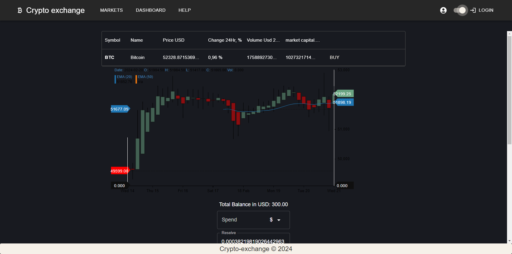

Crypto Exchange Platform Backend

This document outlines the backend setup for the Crypto Exchange Platform,
a robust service built with Node.js. 
The backend is designed to support secure user authentication, real-time data processing,
and seamless interaction with the frontend, ensuring a comprehensive and secure trading experience.

Features

Secure User Authentication: Utilizes bcrypt for hashing passwords and JSON Web Tokens (JWT) for managing user sessions.
Real-Time Communication: Employs Socket.IO for real-time bidirectional event-based communication.
Database Management: Uses MongoDB with Mongoose for efficient data storage and retrieval.
Cross-Origin Resource Sharing (CORS): Configured to ensure the frontend can securely access the backend resources.
Environment Variables: Utilizes dotenv for managing environment variables, enhancing security and configurability.

Getting Started

Follow these steps to set up the backend on your local machine for development and testing purposes.

Prerequisites
Ensure you have Node.js installed on your system. You can download it from Node.js website.